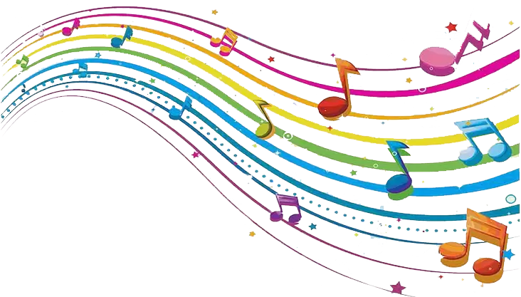

{width="300" .center}

# Notas Musicais

Notas musicais é um CLI para ajudar na formação de escalas e acordes.

Temos dois comandos disponíveis `scales` e `chords`.

## Como Usar?

### Escala

Você pode chamar as escalas via linhas de comando. Por exemplo:

```bash
poetry run notas-musicais scales
```

Retornando os graus e as notas correspondentes as escalas:

```bash
┏━━━┳━━━━┳━━━━━┳━━━━┳━━━┳━━━━┳━━━━━┓
┃ I ┃ II ┃ III ┃ IV ┃ V ┃ VI ┃ VII ┃
┡━━━╇━━━━╇━━━━━╇━━━━╇━━━╇━━━━╇━━━━━┩
│ C │ D  │ E   │ F  │ G │ A  │ B   │
└───┴────┴─────┴────┴───┴────┴─────┘

```

#### Alteração da Tônica da escala

O primeiro parâmetro do CLI é a tônica da escala que deseja exibir. Desta
forma, você alterar a escala retornada. Por exemplo a escala de `F#`:

```bash
poetry run notas-musicais scales F#
```

Resultado em:

```bash
┏━━━━┳━━━━┳━━━━━┳━━━━┳━━━━┳━━━━┳━━━━━┓
┃ I  ┃ II ┃ III ┃ IV ┃ V  ┃ VI ┃ VII ┃
┡━━━━╇━━━━╇━━━━━╇━━━━╇━━━━╇━━━━╇━━━━━┩
│ F# │ G# │ A#  │ B  │ C# │ D# │ F   │
└────┴────┴─────┴────┴────┴────┴─────┘
```

#### Alteração na tonalidade da escala

Você pode alterar a tonalidade da escala também! Esse é o segundo parâmetro da
linha de comando. Por exemplo, a escala de `D#` menor:

```bash
poetry run notas-musicais scales D# menor

┏━━━━┳━━━━┳━━━━━┳━━━━┳━━━━┳━━━━┳━━━━━┓
┃ I  ┃ II ┃ III ┃ IV ┃ V  ┃ VI ┃ VII ┃
┡━━━━╇━━━━╇━━━━━╇━━━━╇━━━━╇━━━━╇━━━━━┩
│ D# │ F  │ F#  │ G# │ A# │ B  │ C#  │
└────┴────┴─────┴────┴────┴────┴─────┘
```

## Acordes

Uso básico

```bash
poetry run notas-musicais chords

┏━━━┳━━━━━┳━━━┓
┃ I ┃ III ┃ V ┃
┡━━━╇━━━━━╇━━━┩
│ C │ E   │ G │
└───┴─────┴───┘

```

### Variações na cifra


```bash
poetry run notas-musicais chords C+

┏━━━┳━━━━━┳━━━━┓
┃ I ┃ III ┃ V+ ┃
┡━━━╇━━━━━╇━━━━┩
│ C │ E   │ G# │
└───┴─────┴────┘
```

Até o momento você pode usar acordes maiores, menores, dimunito e aumentados

## Mais informações sobre o CLI

Para descobrir outras opções, Você pode usar a flag `--help`:

```bash
poetry run notas-musicais scales --help

 Usage: scales [OPTIONS] [TONIC] [TONALITY]

╭─ Arguments ──────────────────────────────────────────────────────────────╮
│   tonic         [TONIC]     Tônica da escala [default: c]                │
│   tonality      [TONALITY]  Tonalidade da escala [default: maior]        │
╰──────────────────────────────────────────────────────────────────────────╯
```
